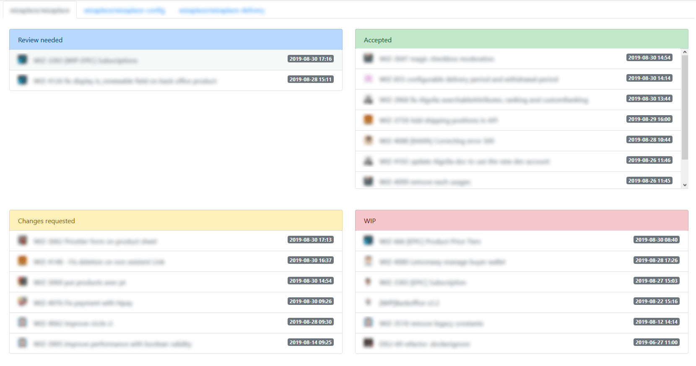

# Github PR Review

Interface to simplify PR management on GitHub. 

## How to use

1. Create a Github's token ([here](https://github.com/settings/tokens)) and select `repo` scope
1. Create `.env.local` from `.env`
1. Fill `GITHUB_TOKEN` with your own token
1. Fill `GITHUB_LABELS_*` with you own labels for the differents categories 

### Demo find by labels



### Configuration example

```
GITHUB_AUTH_METHOD=http_token
GITHUB_TOKEN=
GITHUB_REPOS='["username/repo_1", "username/repo_2", "username_2/repo_1"]'
GITHUB_LABELS_CHANGES_REQUESTED='["Changes requested"]'
GITHUB_LABELS_ACCEPTED='["Accepted"]'
GITHUB_LABELS_WIP='["WIP", "Pending answer"]'
GITHUB_BRANCHS_COLORS='[{"master": "warning"}, {"develop": "success"}, {"feature-*": "primary"}, {"release*": "info"}, , {"hotfix-*": "danger"}]'
GITHUB_BRANCH_DEFAULT_COLOR=danger
GITHUB_FILTERS='["is:pr is:open -label:WIP", "is:pr is:draft"]'
GITHUB_NOTIFICATIONS_EXCLUDE_REASONS='["assign", "comment", "invitation"]'
GITHUB_NOTIFICATIONS_EXCLUDE_REASONS_OTHER_REPOS='["review_requested", "state_change"]'

ENABLE_DARK_THEME=1
RELOAD_ON_FOCUS=0
# Reload time is ms
RELOAD_EVERY=60000
# Mode to use : filter | label
USE_MODE=label
```

If you don't want to reload on focus and reload every x ms, you just need to set `RELOAD_ON_FOCUS=0` and `RELOAD_EVERY=0`.

If you want to search PRs by filters, you can fill `GITHUB_FILTERS`. You can find a list of available filters [here](https://help.github.com/en/articles/searching-issues-and-pull-requests).

To fill `GITHUB_EXCLUDE_REASONS` and `GITHUB_EXCLUDE_REASONS_OTHER_REPOS` you can find the list [here](https://developer.github.com/v3/activity/notifications/#notification-reasons).

## Installation

Install composer and assets:
```sh
make install
```

Start docker containers:
```sh
make start
```

## Check code quality

```sh
make check
```
