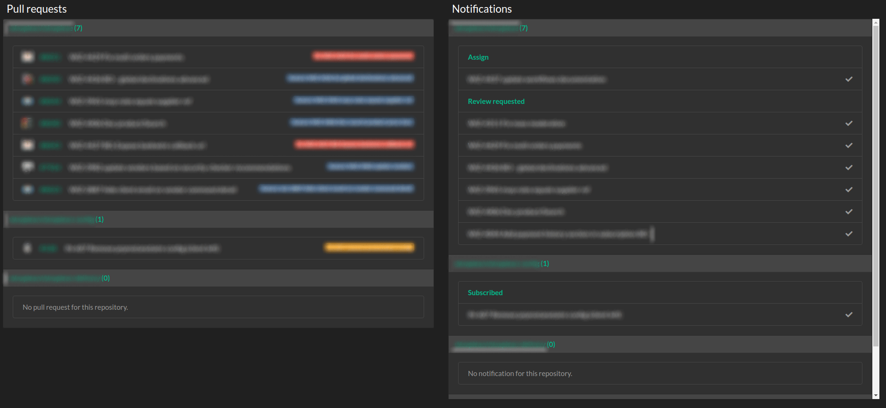
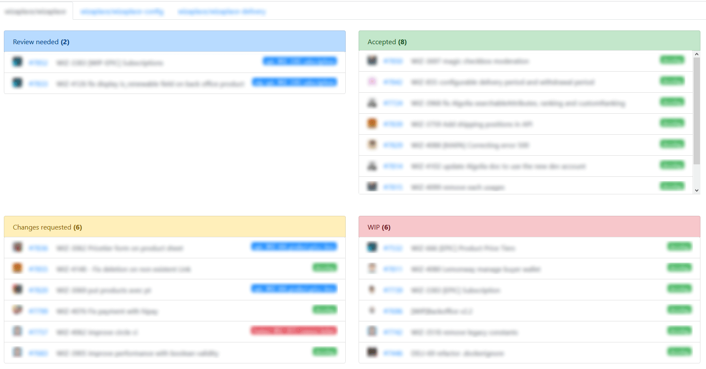

# Github PR Review

Stop wasting time on **code review**.    
Github PR Review is an interface to simplify pull requests management on GitHub.

- **Built for developers**     
Track all pull requests from your teams, or your own pull requests, and do a code review more easier.

- **Sort your pull requests**    
You can use both modes, _label_ or _filter_ and sort your pull requests.

- **Increase your productivity**    
In one single page you have all your watched repositories with the related pull requests and your notifications sorted
by repositories. 

## How to use

### Sort by filters

You can search for issues and pull requests globally across all of GitHub, or search for issues and pull requests within
a particular organization.



[More information about filters](https://help.github.com/en/github/searching-for-information-on-github/searching-issues-and-pull-requests)

### Sort by labels

You can sort you pull requests on four blocks Review needed, Accepted, Changes requested and WIP.    
_Notification view is not possible with this mode_



[More information about labels](https://help.github.com/en/github/managing-your-work-on-github/about-labels)

## Installation

### Requirements

- [Docker](https://docs.docker.com/install/linux/docker-ce/ubuntu) >= 18.04.0
- [Docker compose](https://docs.docker.com/compose/install) >= 1.24.0

### For development

```bash
$ make start-dev
$ make stop-dev
```

### For self hosted

```bash
$ make start-prod
$ make stop-prod
```

### Database connection

Setting up your database information:

```
# .env
[...]
MYSQL_DATABASE=
MYSQL_USER=
MYSQL_PASSWORD=
[...]
```

Only in dev, you can use **[adminer](http://localhost:8012)** to see you database:
- Server: _mysql_
- Username: _env:MYSQL_USER_
- Password: _env:MYSQL_PASSWORD_
- Database: _env:MYSQL_DATABASE_

### Connect to PHP's shell

```bash
$ make shell
```

## Check code quality

You can run all check with:
```bash
$ make check
```

Or you can just run all check individually:
```bash
$ make phpcs
$ make stan
$ make check-doctrine
```

## Contributors

- [ArthurHoaro](https://github.com/ArthurHoaro)
- [cyprille](https://github.com/cyprille)
- [GijsGoudzwaard](https://github.com/GijsGoudzwaard)
- [tleon](https://github.com/tleon)
